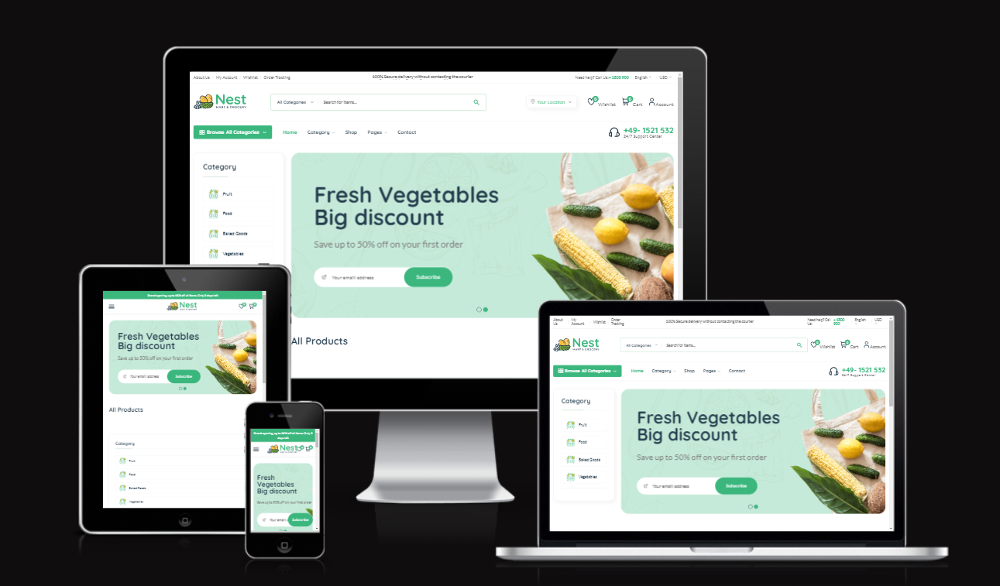
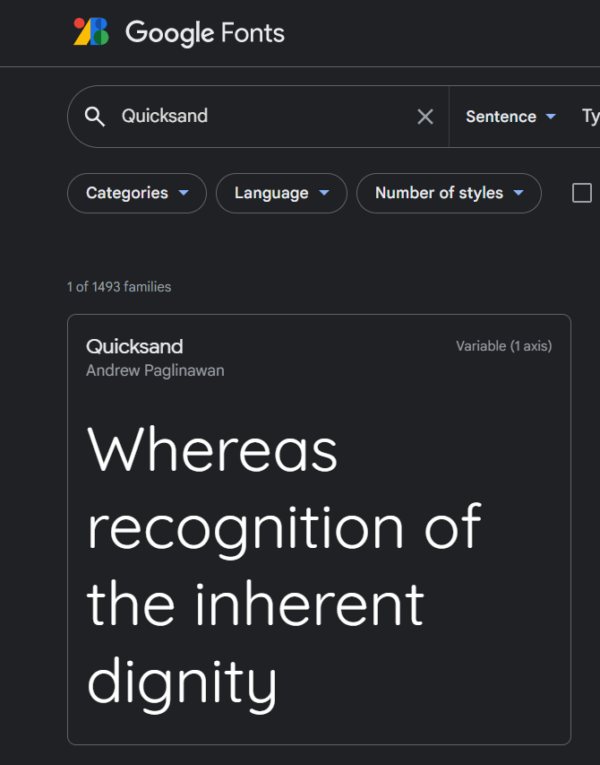
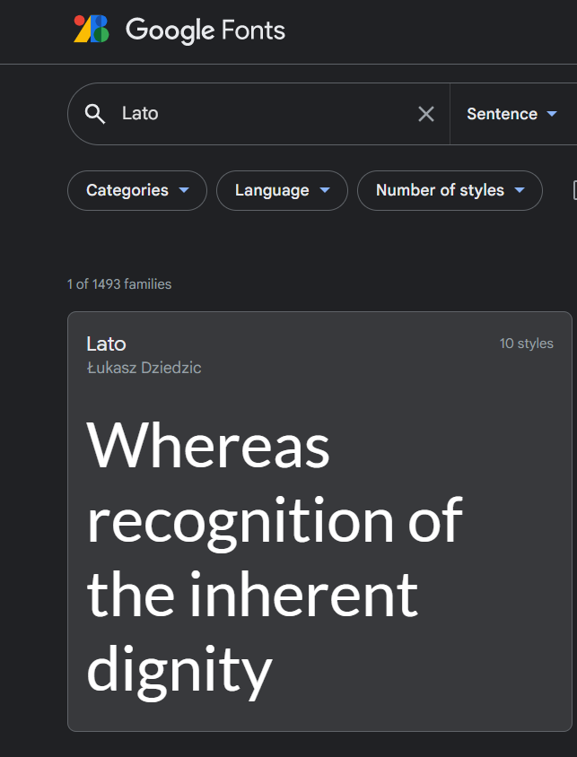
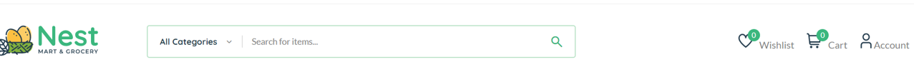

# **The Nest Mart and Grocery**

The Nest Mart and Grocery is a regular store where people can go to browse and order from a variety of goods and products.The variety  stretches from baked good to fresh fruits among others.The store is open 24 hrs with staffs processing order to meet the clients need, it also as a place where vendors can register and be part of the community. Through the The Nest Mart and Grocery website, users can check thier orders and the status of the delivery,they are also aware of where the good are coming from.

 A simple online market place built with the Django Framework using HTML, CSS and Javascript


This fictional site was created for Portfolio Project #4 (Full-Stack Toolkit) - Diploma in Full Stack Software Development Diploma at the [Code Institute](https://www.codeinstitute.net).

[View live website here](https://nextit12.herokuapp.com/)



# Table of Content

* [**Project**](<#project>)
    * [Objective](<#objective>)
    * [Site Users Goal](<#site-users-goal>)
    * [Site Owners Goal](<#site-owners-goal>)
    * [Project Management](<#project-management>)

* [**User Experience (UX)**](<#user-experience-ux>)
    * [Wireframes](<#wireframes>)
    * [User Stories](<#user-stories>)
    * [Site Structure](<#site-structure>)
    * [Design Choices](<#design-choices>)

* [**Existing Features**](<#existing-features>)
    * [Navigation](<#navigation>)
    * [Hero Image](<#hero-image>)
    * [Craft Cafe Menu](<#craft-cafe-menu>)
    * [Workshops Overview](<#workshops-overview>)
    * [Reviews](<#reviews>)
    * [Map](<#map>)
    * [Craft Workshops](<#craft-workshops>)
    * [Booking Form](<#booking-form>)
    * [Craft Cafe Community](<#craft-cafe-community>)
    * [Post Details Page](<#post-details-page>)
    * [Profile Page](<#profile-page>)
    * [Admin Dashboard](<#admin-dashboard>)
    * [Sign Up](<#sign-up>)
    * [Sign In](<#sign-in>)
    * [Sign Out](<#sign-out>)
    * [Footer](<#footer>)

* [**Features Left To Implement**](<#features-left-to-implement>)

* [**Technologies Used**](<#technologies-used>)
    * [Languages](<#languages>)
    * [Frameworks & Software](<#frameworks--software>)
    * [Libraries](<#libraries>)

* [**Testing**](<#testing>)

* [**Deployment**](<#deployment>)

* [**Credits**](<#credits>)

* [**Acknowledgements**](<#acknowledgements>)

# **Project**

## Objective
I absolutely love the idea of browsing through a catalogue and placing an order.The idea of placing and order adding your shipping and billing address and to sell products or services. 

Secondary objectives was to providing customers with product information and review.


## Site Users Goal
This sites give the user the ability to see the products and place orders.It also gives users the ability to place the order,add the shipping address and also pay for thier order. 

## Site Owners Goal
The goal of the site owner is to deliver a site where the users can go through a variety of categories of product,place an order,add thier shipping address and make payment.
The goal is also to allow vendors register and be able to post information about thier product,which is subjected to review by the site owner or by the admin. 

## Project Management

### Github Project Board
I've been using the project board in GitHub to keep my project together. In the initial design phase, it was really helpful to plan the project as a whole, and create the user stories based on my wireframe designs. I created an Epic for each main html page with bullet points for the main desired features. Then, I created a linked User Story for each feature and gave it a level of prioritization using the MoSCoW method and a number of User Story points to indicate the level of difficulty for that feature. 

Later on, during the build, I also used the Project Board to log and track bugs found in my code which could not be fixed immmediately. 


[Back to top](<#table-of-content>)

### Database Schema

Models used (besides standard AllAuth user model) in this project are:

* **Post** - Handles all the posts
* **Comment** - Handles all the comments
* **WorkshopBooking** - Handles the workshop bookings 


# **User Experience (UX)**

## Wireframes
The wireframes for the site were created in the software [Balsamiq](https://balsamiq.com). The wireframes have been created for desktop, tablet and mobile devices. The text content wasn't finalized during the wireframe process. I used it mainly to design the grid system layout and button features for each page. Any differences are down to design choices that were made during the build process.

<details><summary><b>Wireframes</b></summary>


</details><br/>

## User Stories
Here I have listed the main user stories for three types of user. A normal user not logged in, a logged in user and a logged in superuser with administration access to the site. These user stories were then tested and confirmed in the [Testing](<#testing>) section.

### Logged Out Site User
|  | | |
|:-------:|:--------|:--------|
| As a Site User | I can log in so that I can interact fully with the site | &check; |
| As a New User | I can sign up so that I can interact fully with the site | &check; |
| As a Site User | I can log out from the site so that no-one else can interact with the site using my details | &check; |
| As a Site User | I can view the Nest Website menu | &check; |
| As a Site User | I can view the craft workshop schedule | &check; |

### Logged In Site User
|  | | |
|:-------:|:--------|:--------|
| As a Site User | I can log in so that I can interact fully with the site | &check; |
| As a Site User | I can log out from the site so that no-one else can interact with the site using my details | &check; |
| As a Site User | I can view the number of ratings each post so that I can see how popular a specific post is | &check; |
| As a Site User | I can view the number of comments on each post so that I can see how popular a specific post is | &check; |
| As a Site User | I can create a new post so that I can contribute to the craft cafe community | &check; | 
| As a Site User | I can edit any of my posts so that I can amend any errors or add missing information | &check; | 
| As a Site User | I can delete any of my posts so that I can remove unwanted posts from the craft cafe community | &check; | 
| As a Site User | I can create a new comment on an existing post so that I can comment on other user's posts | &check; | 
| As a Site User | I can like an existing post so that I can show my appreciation for other user's posts | &check; |
| As a Site User | I can remove a like from an existing post so that I can remove my appreciation for other user's posts | &check; |
| As a Site User | I can view comments on a specific post so that I can see other user's opinions of the posts | &check; |
| As a Site User | I can add comments on a specific post so that I can give my opinion on other user's posts | &check; |
| As a Site User | I can edit my comments on a specific post so that I can change my opinion on other user's posts | &check; |
| As a Site User | I can delete my comments on a specific post so that I can remove my opinion on other user's posts | &check; |
| As a Site User | I can view a list of all posts I have made on the site so that I can see all the posts I have contributed to the craft cafe community| &check; |
| As a Site User | I can view a list of all comments I have made on the site | &check; |
| As a Site User | I can create a workshop booking so that I can reserve a place on a workshop | &check; |
| As a Site User | I can edit my workshop bookings so that I can change an existing reservation on a workshop | &check; |
| As a Site User | I can delete my workshop bookings so that I can cancel an existing reservation on a workshop | &check; |
| As a Site User | I can view a list of all workshop bookings I have made on the site so that I can see all the workshop activities I have booked in the past and future | &check; |
| As a Site User | I can delete my user account so that I can no longer be part of the craft community if I don't want to | &check; |

### Site Admin

|  | | |
|:-------:|:--------|:--------|
| As a Super User | I can log in so that I can interact fully with the site | &check; |
| As a Super User | I can log out from the site so that no-one else can interact with the site using my details | &check; |
| As a Super User | I can view all the products and review them | &check;
| As a Super User | I can publish products after final checks. | &check;
| As a Super User | I can view the number of likes on each post so that I can see how popular a specific post is | &check; |
| As a Super User | I can view the number of comments on each post so that I can see how popular a specific post is | &check; |
| As a Super User | I can create a new post so that I can contribute to the craft cafe community | &check; | 
| As a Super User | I can edit any posts so that I can amend any errors or add missing information | &check; | 
| As a Super User | I can delete any posts so that I can remove unwanted posts from the craft cafe community | &check; |
| As a Super User | I can approve posts so that they are published on the craft cafe community | &check; |
| As a Super User | I can create a new comment on an existing post so that I can comment on other user's posts | &check; | 
| As a Super User | I can like an existing post so that I can show my appreciation for other user's posts | &check; |
| As a Super User | I can remove a like from an existing post so that I can remove my appreciation for other user's posts | &check; |
| As a Super User | I can view comments on a specific post so that I can see other user's opinions of the posts | &check; |
| As a Super User | I can add comments on a specific post so that I can give my opinion on other user's posts | &check; |
| As a Super User | I can edit any comments made by other users so that I can amend any comments that are not deemed appropriate | &check; |
| As a Super User | I can delete any comments made by other users so that I can remove any inappropriate comments | &check; |
| As a Super User | I can approve comments so that they are published on the craft cafe community | &check; |
| As a Super User | I can view a list of all posts made on the site so that I can see all the posts users have contributed to the craft cafe community| &check; |
| As a Super User | I can view a list of all comments made on the site so that I can see all the comments users have contributed to the craft cafe community | &check; |
| As a Super User | I can create a workshop booking so that I can reserve a place on a workshop for myself or on behalf on another user| &check; |
| As a Super User | I can edit any workshop booking so that I can change an existing reservation | &check; |
| As a Super User | I can delete any workshop booking so that I can cancel an existing reservation | &check; |
| As a Super User | I can approve workshop bookings so that users know their booking has been confirmed | &check; |
| As a Super User | I can view a list of all workshop bookings all users have made on the site so that I can see all the workshop activities in the past and future | &check; |
| As a Super User | I can delete any user account so that I can remove unwanted users from the craft cafe community | &check; |

[Back to top](<#table-of-content>)

## Site Structure

The Craft Café site is split up in two parts: **when the user is logged out** and **when the user is logged in**. Depending on login status different pages are available for the user. When the user is logged out the pages: *Home*, *Menu*, and *Craft Workshops* are available from the Navigation Bar menu. When the user is logged in *Bookings*, *Craft Cafe Community*, and *Profile Page* are available. If you are logged in as an administrator an *Admin* dashboard page is also available. The site is intuitive and prompts the user to sign in if they try to access areas which require a user profile.

Read more about the different choices in the [Features](<#features>) section.

[Back to top](<#table-of-content>)

## Design Choices

* ### Color Scheme

The color scheme chosen for the Craft Café site was based on the tones of the homepage hero background image. I was browsing for café images that were light and bright, as a lot of them are based on brown coffee tones, which I was not keen on for the dual craft aspect of the site. The background image I found has brightly coloured macaroons presented on a piece of decorated table cloth.  I used the online service [Canva](https://www.canva.com/colors/color-wheel/) to build a color palette for the site based on the tones in this photo.


* ### Typography

The main fonts used for the site are 'Quicksand' with a fallback font of cursive and 'Lato' with a fallback font of sans-serif.

* "Quicksand"  is used on the H1,H2,H3 headers . It's a very clean font that works really well in upper case. 

* 'Lato' was chosen for the main body and text sections of the site. It's tidy and easy to read.With Sans-serif has the backup font


<details><summary><b>Fonts</b></summary>





</details><br/>

[Back to top](<#table-of-content>)

# **Features**
The main features of the site are listed below.

## **Existing Features**

### **Navigation**

The navigation bar is very clean and straight forward. Depending if you are logged in or not different menus are visible for the site user. An extra menu item is visible if you are logged in as an administrator.

*Links that are visible to logged out users*

* Nest Mart & Grocery Logo - On the far left hand side of the navigation bar is the Nest Mart & Grocery brand logo. This is visible throughout the site to all user types and contains a link back to the homepage.

* Home - The first menu item listed 'Home' takes the user to the main 'index.html' page with all the general site information listed.
* Search bar - This Section helps the user search the products in the store.
* Wishlist - This section helps the user to add products to his cart but since heor she is not signed in this place when clicked takes them too the sign in page.
* Cart - In this section after the user has shopped and picked up all the product,he can find all the selected products here, but since he or she is not signed in this place when clicked takes them too the sign in page.
* Accounts - Gives the user the opportunity to log in or sign up if not ready a registered user.
* Admin Dashboard - Gives the user the opportunity to add product,this will not be visible if not ready a registered user.
* Order Tracking - Gives the user the opportunity to track orders,this will not be visible  if not ready a registered user.
* My Wishlist- Gives the user the opportunity to log in or sign up if not ready a registered user.
* SignIn - Gives the user the opportunity to log in or sign up if not ready a registered user.

<details><summary><b>Navigation - User Not Logged In</b></summary>




</details><br/>

*Links that are visible to logged in users*

Additional links which are available to logged in users are as follows:

* Contact Us - Lets the user make a booking request for a craft workshop.
* Craft Café Community - Shows all craft café community posts.
* Log Out - Logs out the user.
* Profile Page - Shows logged in users personal profile page.

<details><summary><b>Navigation - User Logged In</b></summary>


</details><br/>

*Link that is visible if user is administrator*

If the user is a superuser, they have one additional menu item available.

* Admin Dashboard - A frontend overview of information regarding the website.

<details><summary><b>Navigation - Admin Logged In</b></summary>


</details><br/>


* Links that are visible to logged out users in the mega menu *

* Browse Category - This link takes the user down the homepage to the 'Menu' section where lists of food and pricing can be found.
* Category - This link takes the user down the homepage to the 'Menu' section where lists of food and pricing can be found.
* Shop - This lists the afternoon craft workshop schedule, and a description and pricing for each activity.
* Vendors - Directs non-community users to create an account.
* Pages - Gives the user the opportunity to log in or sign up if not ready a registered user.
* Contact - Gives the user the opportunity to contact or make enquires.
* Contact number - Gives the user the opportunity to call the 24hrs support 


### **Hero Image**

If you click on 'Home' from the navigation bar menu or on the brand logo found at the top and bottom of every page, you are redirected to the HomePage. The first thing you see is a full screen hero image of coffee and cakes and a large Jumbotron Title for The Craft Café. Below the Cafe Title is a description telling the user about it's unique selling points; Coffee, cake crafts and good company. From the hero callout, you can click directly to the workshops page where there is more information about the craft activites and the booking form for logged on users. 


### **Craft Cafe Menu**

The menu is split into three sections. Food, Drinks, and Desserts. On a desktop device, all three menus are displayed alongside eachother in one row. For tablets, the Desserts section drops down into a centred second row, and for mobile devices, the three menus are displayed one at a time below eachother. Each menu has an accompanying image which fits in with the site colour palette and creative theme, and then the available food items and respective prices are shown in a list under each Menu heading. 

<details><summary><b>Menu</b></summary>


</details><br/>

### **Workshops Overview**

Scrolling down past the menu on the homepage, the user will find an overview of all the craft workshops held in the Craft Café. Each card has a background image displaying an example of the craft category and a clickable title which takes the user into the 'contact.html' page where there is a more detailed summary of each workshop and the option to book places. Underneath the individual workshop cards is also a large button which takes them to the same place. 

On desktop and tablet devices, the cards are displayed on two rows of three, but for mobile devices this changes into three rows of two. 

When you hover over the cards, the font changes colour to indicate that the titles are clickable links.

<details><summary><b>Workshop Overview Cards</b></summary>


</details><br/>

### **Reviews**

Scrolling down past the Workshop Overview Cards, you can read some glowing reviews from Craft Café customers. There is a mixture of reviews to cover all aspects of the products and services it provides. One review relates to the food, one review relates to the craft workshops and the final review relates to a bespoke craft party that was held at the café.

In desktop view, the three reviews can be seen side by side in one row. In tablet and mobile view, only the first two reviews are shown, in tablet view side by side and in mobile view one above the other. 

<details><summary><b>Reviews</b></summary>


</details><br/>

### **Map**

The final part of the homepage is the map section where users can find out the location, opening hours and contact details for the Craft Café.

The Craft Café does not exist, and therefore will not appear in satellite view if the user was to zoom in to the street marked by the address and marker pin. However, if I were to build this café in real life, this pinned highstreet, close to where I grew up,would be a perfect location for it, and so I have chosen to ficticiously pinpoint it's location there. 

The map was created using the Google Maps API. 


### **Craft Workshops**

when the user clicks on the 'Craft Workshops' menu item on the Navigation Bar, or clicks through from the homepage button links in the hero or the Workshops Overview section, they are redirected to this page. 

Workshops are held twice a day, every day apart from on Sundays. From Monday to Friday, they are held in the afternoons from 4 till 6pm and from 6 till 8pm. On Saturdays, the workshops are held in the mornings from 10 till 11.30 and 11.30 till 1. Depending on what day of the week it is determines the theme of the craft activities. Each day has it's own theme, so that users will know the general theme of the craft activity before attending the workshop. If they prefer one particular type of craft, they know this category will always be held on the same day of the week.

There is a button next to each day of the schedule which prompts the user to reserve a place. I don't specify on the website that booking is obligatory, but I try to encourage the users to make a booking throughout the site. If they click on the button, they will be directed down to the bottom of the page where they can make a workshop booking request if they are logged in. 

On desktop and tablet devices, the workshop schedule is displayed with the image on the left and the description on the right. For mobile devices, the image is shown above the description. 

<details><summary><b>Workshops</b></summary>


</details><br/>

### **Booking Form**

If you click on the 'Bookings' menu item from the navigation bar, or you click on the 'Book your Places here' button on the Workshops Page, you will be redirected to the booking request form. 

If you are not logged on, you will see a message saying that you must be logged in to make a booking and there is a link available to login. 


Once the user is logged in, they will be able to see the booking request form. 


The form consists of four mandatory fields from the WorkshopBooking model: Workshop, Day, Time, and Places. If the user tries to submit the form without selection a workshop and a date, an alert will be show to remind them to fill in the fields. The Time field and Places field default to the first option on the list. 


The calendar field is unavailable until a Workshop category has been selected. The Date field in the booking model is set to null=True so that this field stays empty to begin with until a workshop has been selected. I have also set an attribute of 'Read-Only' to this field so that users can not override the calendar datepicker widget and type in strings or dates in the wrong format or outside of the min and max date parameters set against the datepicker calendar.

Once a Workshop has been selected, the calendar becomes active. Dates in the past are not available and the user is restricted to only select the corresponding day of the week in which the workshop is scheduled for up to five months in advance. For example, if they select the All Things Wool workshop, only Mondays can be selected for the next 5 months. 

If a Monday to Friday workshop is selected, the Time field is restricted to only show the afternoon sessions. If the Saturday Kids Crafts workshop is selected, the afternoon sessions are hidden and the user can only select a morning session. 

The user can select up to 10 places in one booking request. This is the maximum number of places on each workshop activity session. 

If the user changes their mind, and goes back to re-select an alternative workshop, the subsequent fields are reset and the user has to re-select their choices again based on the new workshop selected. 

Once the user is happy with their selections, they can click the 'Submit Booking Request' button to send it for approval. Before reaching the approval stage, the booking form goes through a check system to make sure that there are not already more than 10 places booked up on the same workshop session on the same date and time as the user has requested. If there are not enough places available ie. (Existing places booked + requested places > 10) the user gets an alert back to say that there are not enough places left on this workshop, and can they please amend their booking request. 

Once the user has selected a workshop with a sufficient number of places available for what they need, the booking request form goes through successfully to admin to be approved, the user is redirected to their profile page, and a success alert message is displayed. 

<details><summary><b>Booking Request Alert Messages</b></summary>


</details><br/>

Once the booking request is sent successfully, the user can see the details of the booking in their profile page, and monitor the approval status to see when Admin confirms the booking. There is currently no external email notification to the user for this status change at present, but in future I would like to add in an email notification system for when bookings are approved and the status changes to confirmed. 

### **Craft Cafe Community**

If you click on the 'Craft Cafe Community' option on the navigation bar, you will be taken to the Craft Cafe Community Posts Page where registered users can upload photos of things they have made during the Craft Cafe Workshops, and they can like other user's posts as well. This page is only available for logged in users. If the user is not logged in, they will see a message saying that they must login or sign up to view the Craft Cafe Community Posts. 


Once the user is logged in, they will be able to see all approved posts submitted by themselves and other registered craft cafe community members. 


There is a filter available called 'Select Category' so that users can filter all the posts by their preferred category. 

Each post shows a photo if the user has uploaded one (otherwise a default Craft Cafe image is shown), the Title of the post, who it was posted by and when.

Below this the users can see a count of likes and comments for each post. If they want to like a post, they can click on the heart icon. If they click it again, the like will be removed. 

If they click on the 'Add Post' button at the top, a modal pop-up window appears with a form to submit a new post. 


The Post Form has four fields; Title, Category, Image and Content.  The Title and content field are mandatory, but the user can submit the post without uploading a photo. The Category field automatically defaults to 'All Things Wool'. Once the post form has been filled in, it can be viewed in the User Profile Page with a status of Unapproved. Once a superuser has approved the post, it will appear on the Craft Community Posts Page for other users to see and interact with. 

### **Post Details Page**

If a user wishes to see more details on a particular post, they can click on the Post Title on the Craft Cafe Community Page, and this will take them into the 'Post-detail' page where the full content of the post is published alongside a bigger version of the featured image.

On desktop and tablet devices, the image is displayed on the left and the title and content text on the right. On mobile devices, the title and content text are shown below the image. 

<details><summary><b>Post Details</b></summary>


</details><br/>

Above the post, there is a button for the user to return to the full page of community posts. 

Below the post is the Comments Section.  This is displayed with existing comments and the comments submission form side by side for desktop and tablet view, but the comments submission form moves below the existing comments for mobile devices. Only approved comments are published on the post-details page. If no comments have been published, the user is prompted to make a comment. The comment submission form consists of one field; the comment content text input box. A user cannot submit a comment without typing something in this box. 

<details><summary><b>Comments</b></summary>


</details><br/>

Once the comment has been posted successfully, an alert is shown at the top of the screen that the comment has been submitted, and instead of the comments form, the user can now see a message which tells them that their comment is awaiting approval. They can also check on the approval status of their comments on the profile page. 


Once the comment has been approved by Admin, it will automatically appear in the Comments section. 

### **Profile Page**

Every user has their own personalised profile page where they can track all their interaction on the Craft Cafe website. Once a user is logged in, a new icon will appear next to the Logout option in the navigation bar which represents the link to their profile.


The first item on the profile page is the user's personal account details. The user can see their username and email address and they have the option here to Delete their account if they wish.


If the user clicks the 'Delete Account' button, they are taken to an additional page to confirm whether they really wish to delete their registered account and all posts and comments which go with it? If the user changes their mind, they can click the 'Go Back' button to return to their profile without deleting anything. However, if they wish to continue, they can click on the 'Delete My Account' button, and the user account will be removed from the database and the user will be redirected back to the homepage as a logged off user with no registered account. 


Below the account details, the user is then presented with three lists. All the bookings they have made, all the posts they have submitted and all the comments they have written. If they haven't made any contributions to the Craft Cafe Community, the list remains empty and they are prompted to begin making contributions, with a link to do so redirecting them to the appropriate page. 


In the bookings list, the user is shown all bookings made by that user including the Workshop Category, the Workshop date and time, and the number of places reserved. The user is also shown the approval Status of this booking depending on whether it has been approved yet by Admin. 

In the posts list, the user is shown all posts submitted to the Craft Cafe Community by that user. The user is shown the Title, Category, Date Posted, number of likes, number of comments and the approval status. 

In the comments list, the user is shown all comments written on Craft Cafe posts by that user. The user is shown the Post the comment was made on, the comment, the date the comment was made and the approval status. 

In the posts list and the comments list, the user can click on the post title to drill down into the post-details.

All bookings, posts and comments have an 'Edit' button and a 'Delete' button next to them. 

<details><summary><b>Edit Bookings, Posts and Comments</b></summary>


</details><br/>

<details><summary><b>Delete Bookings, Posts and Comments</b></summary>


 

</details><br/>

If a user clicks the 'Edit' button, they are taken into an edit page where a form is presented to them with the existing data pre-populated from the booking, post or comment they wish to edit. They can update any fields they wish (following the same booking validation guidelines as before) and then save the changes. These changes are then reflected in the profile page list for the user to see. If the user changes their mind, they can click the 'Go Back' button to return to the profile page without editing anything or affecting the approval status.

If a user clicks on the 'Delete' button, they are taken into a confirmation deletion page where they must confirm whether they really want to delete this data or not. If the user changes their mind, they can click the 'Go Back' button to return to their profile without deleting anything. However, if they wish to continue, they can click on the 'Delete' button and the corresponding booking, post or comment will be permanently removed from the site. 

After editing or deleting, the user is redirected back to their profile page.

### **Admin Dashboard**

Although all admin CRUD functionality can be accessed and managed through the superuser logon to the /admin page, I also decided to create a frontend admin page where superusers can see a general overview of how well the Craft Cafe website is performing and how much interaction it's getting with its community. Firstly, the superuser can see some website statistics:
* Total number of bookings made through the site
* Total number of posts made on the site
* Total number of comments made on the site


Below the general site statistics, the superuser can see three lists. 

<details><summary><b>Dashboard Lists</b></summary>


 

</details><br/>

In the bookings list, the superuser is shown all bookings made all site users including username, the Workshop Category, the Workshop date and time, and the number of places reserved. The superuser is also shown the approval Status of this booking depending on whether it has been approved yet. This approval status icon is also a toggle button, and can be clicked to approve or unapprove the booking. The icon will change according to the approval status, and an alert message will be shown to confirm the approval/unapproval success.

In the posts list, the superuser is shown all posts information. The user is shown the Author, Title, Category, Date Posted, number of likes, number of comments and the approval status. This approval status icon is also a toggle button, and can be clicked to approve or unapprove the post. The icon will change according to the approval status, and an alert message will be shown to confirm the approval/unapproval success.

In the comments list, the superuser is shown all comments written by all users. The superuser is shown the author, the post the comment was made on, the comment, the date the comment was made and the approval status. This approval status icon is also a toggle button, and can be clicked to approve or unapprove the comment. The icon will change according to the approval status, and an alert message will be shown to confirm the approval/unapproval success.

All bookings, posts and comments have an 'Edit' button and a 'Delete' button next to them. 

<details><summary><b>Edit Bookings, Posts and Comments</b></summary>


</details><br/>

<details><summary><b>Delete Bookings, Posts and Comments</b></summary>


 

</details><br/>

If a superuser clicks the 'Edit' button, they are taken into an edit page where a form is presented to them with the existing data pre-populated from the booking, post or comment they wish to edit. They can update any fields they wish (following the same booking validation guidelines as before) and then save the changes. The superuser also has the additional edit field of the approval checkbox if they wish to change the approval status here as well. Once the changes have been saved the superuser is redirected back to the Admin Dashboard. If the superuser changes their mind, they can click the 'Go Back' button to return to the admin dashboard without editing anything.

If a superuser clicks on the 'Delete' button, they are taken into a confirmation deletion page where they must confirm whether they really want to delete this data or not. If the superuser changes their mind, they can click the 'Go Back' button to return to the admin dashboard without deleting anything. However, if they wish to continue, they can click on the 'Delete' button and the corresponding booking, post or comment will be permanently removed from the site. Once the item has been deleted, the superuser is redirected back to the Admin Dashboard.

### **Sign Up**

Users who are new to the site, or haven't previously created an account can click on the Signup Menu option on the Navigation Bar to create a user account. I have used the standard AllAuth user model for the signup process and fields which appear. 

 

### **Sign In**

If a user has a Craft Cafe account, they can click on the Login menu option in the Navigation Bar to login, and gain access to the additional areas of the website for Craft Cafe Community users. If they try to access areas which require a login, they are prompted to follow the links to login, or signup if they don't currently have an account. 

 

### **Sign Out**

If the user wishes to sign out, once signed in, the login menu option turns into a logout menu option for them to select. 

 

### **Footer**

The site footer has three link elements. 

1. My details as the site designer. If you click on the link, you are taken to my GitHub site.
2. The Craft Cafe brand logo. If you click on the link, you are taken back to the top of the Homepage.
3. Social media links. I have included links to Facebook, Twitter and Instagram. These links simply go to the social media homepage, as this is a ficticious website and does not have any real social media accounts to connect to and follow. 

These three elements are positioned respectively on the far left, center and far right of the screen. For mobile devices, they are all positioned in the center one above the other in three rows.

<details><summary><b>Footer</b></summary>


</details><br/>

### Features Left to Implement

* Develop an email notification system for the following activities:
    * Booking confirmation to the user
    * Booking requests pending approval to admin users
* Add option for a user to submit a review about the Craft Café
* Ability to click on the comment count speech bubble to add a comment
* Success alert messages for deletions carried out in the profile page
* Success alert messages for edits and deletions carried out in the admin cafe dashboard page
* Add a front end admin section to manage user accounts; Edit, delete and manage permissions. 
* Add a count of total users in the admin dashboard cafe statistics section

[Back to top](<#table-of-content>)

# Technologies Used

## Languages

* [Python](https://en.wikipedia.org/wiki/Python_(programming_language)) - Provides the functionality for the site.
* [HTML5](https://en.wikipedia.org/wiki/HTML) - Provides the content and structure for the website.
* [CSS3](https://en.wikipedia.org/wiki/CSS) - Provides the styling for the website.
* [JavaScript](https://en.wikipedia.org/wiki/JavaScript) - Provides interactive elements of the website

## Frameworks & Software
* [Bootstrap](https://getbootstrap.com/) - A CSS framework that helps build solid, responsive, mobile-first sites
* [Django](https://www.djangoproject.com/) - A model-view-template framework
* [Balsamiq](https://balsamiq.com/) - Used to create the wireframes
* [Github](https://github.com/) - Used to host the repository, store the commit history and manage the project board containing user stories and bug reports.
* [Heroku](https://en.wikipedia.org/wiki/Heroku) - A cloud platform that the application is deployed to.
* [Lighthouse](https://developer.chrome.com/docs/lighthouse/overview/) - Used to test site performance.
* [Responsive Design Checker](https://www.responsivedesignchecker.com/) - Used for responsiveness check across devices.
* [Favicon](https://favicon.io/) - Used to create the favicon.
* [Google Chrome DevTools](https://developer.chrome.com/docs/devtools/) - Used to debug and test responsiveness.
* [Cloudinary](https://cloudinary.com/) - A service that hosts image files in the project.
* [My Free Logo Maker](https://myfreelogomaker.com/explore) - Used to create the Craft Cafe brand logo
* [Google Maps API](https://mapsplatform.google.com/) - Used to integrate Google's Place details, search, and autocomplete into apps
* [Canva](https://www.canva.com/colors/color-wheel/ ) - Used to create the colour palette
* [HTML Validation](https://validator.w3.org/) - Used to validate HTML code
* [CSS Validation](https://jigsaw.w3.org/css-validator/) - Used to validate CSS code
* [JSHint Validation](https://jshint.com/) - Used to validate JavaScript code

## Libraries

[Back to top](<#table-of-content>)

The libraries used in this project are located in the requirements.txt file and have been documented below

* [asgiref](https://pypi.org/project/asgiref/) - ASGI is a standard for Python asynchronous web apps and servers to communicate with each other, and positioned as an asynchronous successor to WSGI.
* [cloudinary](https://pypi.org/project/cloudinary/) - The Cloudinary Python SDK allows you to quickly and easily integrate your application with Cloudinary. Effortlessly optimize, transform, upload and manage your cloud's assets.
* [dj3-cloudinary-storage](https://pypi.org/project/dj3-cloudinary-storage/) - Django Cloudinary Storage is a Django package that facilitates integration with Cloudinary by implementing Django Storage API.
* [Django](https://pypi.org/project/Django/) - Django is a high-level Python web framework that encourages rapid development and clean, pragmatic design.
* [django-allauth](https://pypi.org/project/django-allauth/) - Integrated set of Django applications addressing authentication, registration, account management as well as 3rd party (social) account authentication.
* [django-crispy-forms](https://pypi.org/project/django-crispy-forms/) - Used to integrate Django DRY forms in the project.
* [gunicorn](https://pypi.org/project/gunicorn/) - Gunicorn ‘Green Unicorn’ is a Python WSGI HTTP Server for UNIX. It’s a pre-fork worker model ported from Ruby’s Unicorn project. The Gunicorn server is broadly compatible with various web frameworks, simply implemented, light on server resource usage, and fairly speedy.
* [oauthlib](https://pypi.org/project/oauthlib/) - OAuthLib is a framework which implements the logic of OAuth1 or OAuth2 without assuming a specific HTTP request object or web framework.
* [psycopg2](https://pypi.org/project/psycopg2/) - Psycopg is the most popular PostgreSQL database adapter for the Python programming language.
* [PyJWT](https://pypi.org/project/PyJWT/) - A Python implementation of RFC 7519.
* [python3-openid](https://pypi.org/project/python3-openid/) - OpenID support for modern servers and consumers.
* [pytz](https://pypi.org/project/pytz/) - This is a set of Python packages to support use of the OpenID decentralized identity system in your application, update to Python 3
* [requests-oauhlib](https://pypi.org/project/requests-oauthlib/) - P    rovides first-class OAuth library support for Requests.
* [sqlparse](https://pypi.org/project/sqlparse/) - sqlparse is a non-validating SQL parser for Python. It provides support for parsing, splitting and formatting SQL statements.
* [Summernote](https://summernote.org/) - a JavaScript library that helps you create WYSIWYG editors online.

# Testing

Please click [**_here_**](TESTING.md) to read more information about testing The Craft Cafe

[Back to top](<#contents>)

# Deployment

## Deployment To Heroku

The project was deployed to [Heroku](https://www.heroku.com). 

To deploy, please follow the process below:

1. To begin with we need to create a GitHub repository from the [Code Institute template](https://github.com/Code-Institute-Org/gitpod-full-template) by following the link and then click 'Use this template'.

2. Fill in the details for the new repository and then click 'Create Repository From Template'.

3. When the repository has been created, click on the 'Gitpod' button to open it in the GitPod Editor.

4. Now it's time to install Django and the supporting libraries that are needed, using the following commands:

* ```pip3 install 'django<4' gunicorn```
* ```pip3 install 'dj_database_url psycopg2```

5. When Django and the libraries are installed we need to create a requirements file.

* ```pip3 freeze --local > requirements.txt``` - This will create and add required libraries to requirements.txt

<details><summary><b>Heroku Deployment - Step 5</b></summary>


</details><br />

6. Now it's time to create the project.

* ```django-admin startproject YOUR_PROJECT_NAME .``` - This will create the new project.

7. When the project is created we can now create an application. My project consists of two apps; Community and Booking

* ```python3 manage.py startapp APP_NAME``` - This will create an application

8. We now need to add the application to settings.py in the INSTALLED_APPS list.

8. Now it is time to do our first migration and run the server to test that everything works as expected. This is done by writing the commands below.

* ```python3 manage.py makemigrations``` - This will prepare the migrations
* ```python3 manage.py migrate``` - This will migrate the changes
* ```python3 manage.py runserver``` - This runs the server. To test it, click the open browser button that will be visible after the command is run.

9. Now it is time to create our application on Heroku, attach a database, prepare our environment and settings.py file and setup the Cloudinary storage for our static and media files.

* Once signed into your [Heroku](https://www.heroku.com/) account, click on the button labeled 'New' to create a new app. 

10. Choose a unique app name, choose your region and click 'Create app".


11. Next we need to connect an external PostgreSQL database to the app from [ElephantSQL](https://customer.elephantsql.com/login).  Once logged into your ElephantSQL dashboard, you click 'Create New Instance' to create a new database. Give the database a: 
* Name
* Tiny Turtle Free Plan
* Selected data center near you

and click 'Create Instance'. Return to your ElephantSQL Dashboard, and click into your new database instance. Copy the Database URL and head back to Heroku.

12. On the Heroku app settings, click on the 'Reveal Config Vars' button. Create a config variable called DATABASE_URL and paste in the URL you copied from ElephantSQL. This connects the database into the app. 

13. Go back to GitPod and create a new env.py in the top level directory. Then add these rows.

* ```import os``` - This imports the os library
* ```os.environ["DATABASE_URL"]``` - This sets the environment variables.
* ```os.environ["SECRET_KEY"]``` - Here you can choose whatever secret key you want.

14. Back in the Heroku Config Vars settings, create another variable called SECRET_KEY and copy in the same secret key as you added into the env.py file. Don't forget to add this env.py file into the .gitignore file so that it isn't commited to GitHub for other users to find. 

15. Now we have to connect to our environment and settings.py file. In the settings.py, add the following code:

```import os```

```import dj_database_url```

```if os.path.isfile("env.py"):```

```import env```

16. In the settings file, remove the insecure secret key and replace it with:
```SECRET_KEY = os.environ.get('SECRET_KEY')```

17. Now we need to comment out the old database settings in the settings.py file (this is because we are going to use the postgres database instead of the sqlite3 database).

Instead, we add the link to the DATABASE_URL that we added to the environment file earlier.

18. Save all your fields and migrate the changes again.

```python3 manage.py migrate```

24. Now it's time to tell our app where to find the templates directory, by adding the following code into the settings.py file. 

```TEMPLATES_DIR = os.path.join(BASE_DIR, 'templates')```

25. Let's change the templates directory to TEMPLATES_DIR in the templates array.


26. To be able to get the application to work through Heroku we also need to add our Heroku app and localhost to the ALLOWED_HOSTS list:

```ALLOWED_HOSTS = ['https://nextit12.herokuapp.com/', 'localhost']```

27. Now we just need to create the basic file directory in Gitpod.

* Create 3 folders in the top level directory: **media**, **static**, **templates**

* Create a file called **Procfile* and add the line ```web: gunicorn ecomprj.wsgi --preload``` to it.

28

28. Now you can save all the files and prepare for the first commit and push to Github by writing the lines below.

* ```git add .```
* ```git commit -m "Deployment Commit```
* ```git push```

29. Before moving on to the Heroku deployment we just need to add one more thing in the config vars. We need to add "PORT" in the KEY input field and "8000" in the VALUE field. If we don't add this there might be problems with the deployment.

30. Now it's time for deployment. Scroll to the top of the settings page in Heroku and click the 'Deploy' tab. For deployment method, select 'Github'. Search for the repository name you want to deploy and then click connect.

31. Scroll down to the manual deployment section and click 'Deploy Branch'. Hopefully the deployment is successful!

The live link to the Nest Ecommerce site on Heroku can be found [here](https://nextit12.herokuapp.com/). And the Github repository can be found [here](https://github.com/diddyjax19/ecomprj).

[Back to top](<#table-of-content>)

## How To Fork The Repository On GitHub

It is possible to make an independent copy of a GitHub Repository by forking the GitHub account. The copy can then be viewed and it is also possible to make changes in the copy without affecting the original repository. To fork the repository, follow these steps:

1. After logging in to GitHub, locate the repository. On the top right side of the page there is a 'Fork' button. Click on the button to create a copy of the original repository.


[Back to top](<#table-of-content>)

## Cloning And Setting Up This Project

To clone and set up this project you need to follow the steps below.

1. When you are in the repository, find the code tab and click it.
2. To the left of the green GitPod button, press the 'code' menu. There you will find a link to the repository. Click on the clipboard icon to copy the URL.
3. Use an IDE and open Git Bash. Change directory to the location where you want the cloned directory to be made.
4. Type 'git clone', and then paste the URL that you copied from GitHub. Press enter and a local clone will be created.


5. To be able to get the project to work you need to install the requirements. This can be done by using the command below:

* ```pip3 install -r requirements.txt``` - This command downloads and installs all required dependencies that is stated in the requirements file.

6. The next step is to set up the environment file so that the project knows what variables that needs to be used for it to work. Environment variables are usually hidden due to sensitive information. It's very important that you don't push the env.py file to Github (this can be secured by adding env.py to the .gitignore-file). The variables that are declared in the env.py file needs to be added to the Heroku config vars. Don't forget to do necessary migrations before trying to run the server.

* ```python3 manage.py migrate``` - This will do the necessary migrations.
* ```python3 manage.py runserver``` - If everything i setup correctly the project is now live locally.

[Back to top](<#table-of-content>)

# Credits

## Content

* The colour scheme was created using [Canva](https://www.canva.com/colors/color-wheel/)
* [Balsamiq](https://balsamiq.com/wireframes/) was used to create the wireframes.
* The Favicon in the browser was created in https://favicon.io/
* The fonts were taken from [Google Fonts](https://fonts.google.com/)
* The logo was created using [My Free Logo Maker](https://myfreelogomaker.com/explore)
* The images were sourced from [Unsplash](https://unsplash.com/photos/Rs_i9jyJ4rY?like_photo=true)

## Technical

* I took inspiration for how to create a booking system app using the [Dev Genius Blog](https://blog.devgenius.io/django-tutorial-on-how-to-create-a-booking-system-for-a-health-clinic-9b1920fc2b78) tutorial.
* I installed [Summernote](https://summernote.org/) to help with the text field editor
* I read a many sections of the [Django documentation](https://docs.djangoproject.com/en/3.2/ref/contrib/admin/#django.contrib.admin.ModelAdmin.list_display) with parts of Django I didn't fully understand from the walkthroughs, or with features that I wanted that weren't covered on the course. 
* I watched this [Study gyaan](https://www.youtube.com/watch?v=qvlPrL7k-VQ) tutorial to help build the initial Homepage which had no views. 
* I used Django AllAuth to build the login system
* I used Django Crispy forms to create the forms
* I read this [Stack Overflow](https://stackoverflow.com/questions/62697613/how-to-navigate-to-a-different-page-using-id-in-django) article explaining how to create a Django url link to a particular section of a template html page. 
* I read the following article from [ordinarycoders.com](https://ordinarycoders.com/blog/article/add-a-custom-favicon-to-your-django-web-app)on how to add a favicon into a Django project.
* I used the Google Maps API to create my site location map.
* I used this article I read on [GeeksforGeeks](https://www.geeksforgeeks.org/verbose_name-django-built-in-field-validation/) on how to display a field name differently to how it is named in the Django model.
* I watched this tutorial on slugs from [learndjango.com](https://learndjango.com/tutorials/django-slug-tutorial)
* I watched this tutorial on edit and delete views from [codemy.com](https://www.youtube.com/watch?v=8NPOwmtupiI&list=PLCC34OHNcOtr025c1kHSPrnP18YPB-NFi&index=7)
* I watched this tutorial on Cloudinary front end uploads from [www.section.io](https://www.section.io/engineering-education/uploading-images-to-cloudinary-from-django-application/)
* I read this article on how to create a filter on my posts page on [Stack Overflow](https://stackoverflow.com/questions/44369538/creating-django-filter-in-a-bootstrap-dropdown-based-on-the-django-admin-created)
* I read this article on how to set up Cloudinary uploads on the front-end [Section.io](https://www.section.io/engineering-education/uploading-images-to-cloudinary-from-django-application/)
* I found an article on [Tutorialpoint.com](https://www.tutorialspoint.com/How-to-stop-form-submission-using-JavaScript) which explained how to delay the form submission until field validation had been done through Javascript
* I found an article on [Stack Overflow](https://stackoverflow.com/questions/50869566/jquery-datepicker-cant-read-value-using-val-method) which helped to read the value of a datapicker field using Javascript
* I read the following articles when trying to create my calendar datepicker for my booking form:
    * [GeeksforGeeks](https://www.geeksforgeeks.org/jquery-ui-datepicker-beforeshowday-option/)
    * [Stack Overflow](https://stackoverflow.com/questions/5416767/get-selected-value-text-from-select-on-change)
    * [Stack Overflow](https://stackoverflow.com/questions/12932959/remove-values-from-select-list-based-on-condition)

# Acknowledgements
This fictional site was created for Portfolio Project #4 (Full-Stack Toolkit) - Diploma in Full Stack Software Development at the [Code Institute](https://www.codeinstitute.net). I would like to thank my mentor [Dario Carrasquel] for his support and feedback during the project.


[Back to top](<#table-of-content>)

